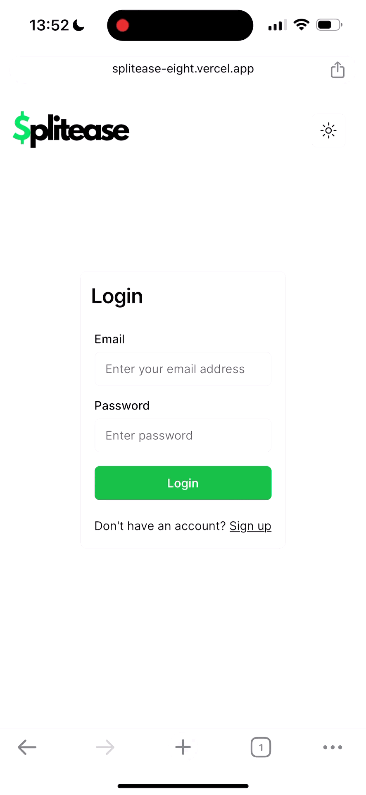
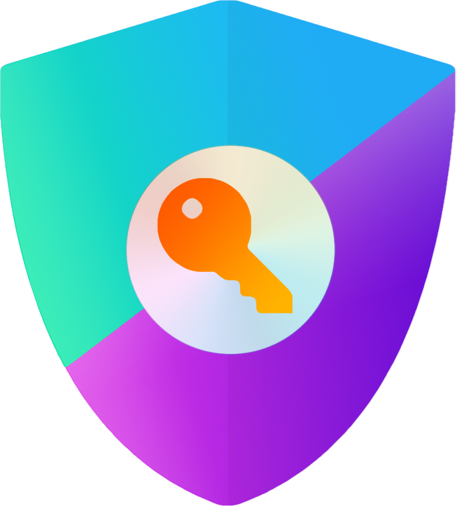

# Splitease, a full-stack Next.js application, where we turn the chore of managing group expenses into a breeze.

This is a [Next.js](https://nextjs.org/) project bootstrapped with [`create-next-app`](https://github.com/vercel/next.js/tree/canary/packages/create-next-app).

## Screenshots

<p align="center">
  
</p>

Hello this is a test for apple support.
Hello this is another test

## Tech Stack

  <table>
  <tr>
    <td align="center">
      
      <br>Next.js 14
    </td>
    <td align="center">
      
      <br>Typescript
    </td>
    <td align="center">
      
      <br>NextAuth.js
    </td>
    <td align="center">
      
      <br>postgreSQL
    </td>
    <td align="center">
      
      <br>Cypress
      </td>
    <td align="center">
      
      <br>Vercel
    </td>
  </tr>
</table>

###

## Installation

1. Clone the repo

```
git clone https://github.com/rollokd/Splitease
```

2. Install dependencies

```
npm install
```

3. Start development server

```
npm run dev
```

## Development Process

Splitease is a web application intended to make keep track of expenses within groups simple.

We started development with wiring framing the design in Excalidraw and defining the features and user experience. We then divided up the work by feature and page of the application. Adding all the issues to Linear to keep track of our work. During our morning standups we made sure that we didn't repeat work and didn't block any other work from continuing.

Once we reached our MVP, we had another group meeting to finalise design details, user flow and the priority of newer features to be added. These issues and features became our next sprint and we continued our regular work, revaluating regularly to make sure our features still fit within the main concept of the app.

Our testing started with End-to-end testing using Cypress, later adding some unit tests done with Jest.

## Features

- **Dashboard for Quick Overviews:**
  - A user-friendly dashboard that presents essential information at a glance, helping users keep track of their financial interactions and balances.
  - Includes an Analytics page with comprehensive charts for deeper insights into finances.
- **Settlements:**
  - Allows users to settle their accounts within a group, simplifying the process of balancing expenses. Accounts can also be settled with someone specific, providing a personalized way to manage and clear balances.
- **Create and Edit Groups:**
  - Users have the flexibility to create new groups as needed and can edit existing ones to reflect changes.
- **Manage Group Members:**
  - Adding or removing group members is straightforward, also ensuring that the group composition remains up-to-date with real-life changes.

## Contributors ✨

Our amazing team ([emoji key](https://allcontributors.org/docs/en/emoji-key)):

<table>
  <tr>
     <td align="center" ><a href="https://github.com/rollokd"><br /><sub><b><a href="https://www.linkedin.com/in/rollo-kennedy-dyson" title="linkedin">Rollo Kennedy-Dyson</a></b></sub></a><br /><a href="https://github.com/rollokd/splitease/commits?author=rollokd" title="Code">💻</a> <a href="#ideas-rollokd" title="Ideas & Planning">🤔</a> <a href="#review-rollokd" title="Reviewed Pull Requests">👀</a> <a href="#design-rollokd" title="Design">🎨</a> <a href="#maintain-rollokd" title="Maintenance">🚧</a></td>
     <td align="center" ><a href="https://github.com/Anloms"><br /><sub><b><a href="https://www.linkedin.com/in/ola-smolna/" title="linkedin">Ola Smolna</a></b></sub></a><br /><a href="https://github.com/rollokd/splitease/commits?author=anloms" title="Code">💻</a> <a href="#ideas-anloms" title="Ideas & Planning">🤔</a> <a href="#review-anloms" title="Reviewed Pull Requests">👀</a> <a href="#design-anloms" title="Design">🎨</a> <a href="#maintain-anloms" title="Maintenance">🚧</a></td>
     <td align="center" ><a href="https://github.com/Arteaga0415"><br /><sub><b><a href="https://www.linkedin.com/in/sebastian-arteaga-ronga/" title="linkedin">Sebastian Arteaga</a></b></sub></a><br /><a href="https://github.com/rollokd/splitease/commits?author=Arteaga0415" title="Code">💻</a> <a href="#ideas-Arteaga0415" title="Ideas & Planning">🤔</a> <a href="#review-Arteaga0415" title="Reviewed Pull Requests">👀</a> <a href="#design-Arteaga0415" title="Design">🎨</a> <a href="#maintain-Arteaga0415" title="Maintenance">🚧</a></td>
     <td align="center" ><a href="https://github.com/ByteBlink"><br /><sub><b><a href="https://www.linkedin.com/in/jakupienes/" title="linkedin">Enes Jakupi</a></b></sub></a><br /><a href="https://github.com/rollokd/splitease/commits?author=ByteBlink" title="Code">💻</a> <a href="#ideas-ByteBlink" title="Ideas & Planning">🤔</a> <a href="#review-ByteBlink" title="Reviewed Pull Requests">👀</a> <a href="#design-ByteBlink" title="Design">🎨</a> <a href="#maintain-ByteBlink" title="Maintenance">🚧</a></td>
     <td align="center" ><a href="https://github.com/freeflyaz"><br /><sub><b><a href="https://www.linkedin.com/in/freeflyaz/" title="linkedin">Gabe Mata</a></b></sub></a><br /><a href="https://github.com/rollokd/splitease/commits?author=freeflyaz" title="Code">💻</a> <a href="#ideas-freeflyaz" title="Ideas & Planning">🤔</a> <a href="#review-freeflyaz" title="Reviewed Pull Requests">👀</a> <a href="#design-freeflyaz" title="Design">🎨</a> <a href="#maintain-freeflyaz" title="Maintenance">🚧</a></td>
  </tr>
</table>
